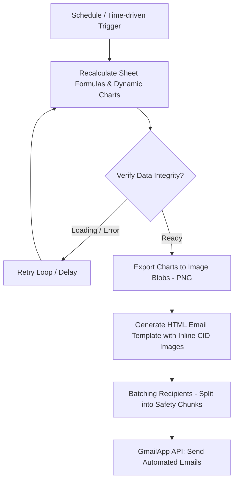

# 📊 TGE Market Data Chart Generator & Automated Newsletter (Google Apps Script)

Automatyczny system raportowania i wysyłki cotygodniowych e-maili z notowaniami cen energii elektrycznej oraz gazu ziemnego z Towarowej Giełdy Energii (TGE)[cite: 7, 8, 9]. Projekt bazuje na Google Apps Script i współpracuje z arkuszem zbiorczym zasilanym przez repozytorium [tge-market-data-sync](https://github.com/majawt-hash/tge-market-data-sync).

## 📌 Problem Biznesowy i Cel
Ilość danych giełdowych (notowania terminowe roczne BASE_Y, kwartalne oraz certyfikaty) bywa przytłaczająca dla końcowych klientów i inwestorów. System automatyzuje proces generowania przejrzystych podsumowań wizualnych (wykresów) oraz tabel cenowych, a następnie dystrybuuje je cyklicznie do szerokiej bazy odbiorców biznesowych (B2B).

## 🔑 Kluczowe Funkcjonalności
* **Dynamiczna Generacja Wykresów:** Odczyt danych z dedykowanych zakładek Google Sheets i automatyczne przetwarzanie wykresów giełdowych energii elektrycznej oraz gazu na obrazy (PNG Blobs).
* **Mechanizm Retry/Polling:** Inteligentne weryfikowanie stanu załadowania formuł w arkuszu (pętla przeliczająca dane do momentu pełnej spójności przed generowaniem obrazów).
* **Wysyłka Pakietowa (Mail Batching):** Podział listy odbiorców na małe paczki (np. po 20 adresów w ukrytej kopii BCC), co zapobiega przekroczeniu limitów Gmail API oraz trafianiu do spamu.
* **Szablon E-mail HTML z obrazami Inline (CID):** Umieszczanie wygenerowanych wykresów bezpośrednio w treści e-maila jako załączniki CID (`cid:ee`, `cid:gas`), zapewniające prawidłowe wyświetlanie grafiki u każdego klienta pocztowego.
* **Środowiska TEST / PROD & Force Run:** Wbudowane przełączniki do bezpiecznych testów oraz możliwość wymuszenia wysyłki poza harmonogramem za pomocą poleceń systemowych.

## 🛠️ Architektura i Technologia
* **Language:** Google Apps Script (JavaScript ES6)
* **Platform:** Google Workspace / Google Sheets API / Gmail API
* **Integracje:** [tge-market-data-sync](https://github.com/majawt-hash/tge-market-data-sync) (źródło aktualnych danych giełdowych)
* **Wymagane uprawnienia:** `SpreadsheetApp`, `GmailApp`, `PropertiesService`, `Utilities`

## 📈 Zakres Monitorowanych Rynków
1. **Energia Elektryczna (EE):** Notowania kontraktów rocznych BASE_Y, kwartalnych BASE_Q, bilansujących oraz certyfikatów PMOZE_A i PMOZE-BIO.
2. **Gaz Ziemny (GAS):** Notowania rocznych kontraktów GAS_BASE_Y oraz kwartalnych GAS_BASE_Q.

---
*Uwaga: Repozytorium ma charakter demonstracyjny i przedstawia architekturę rozwiązań automatyzacji bez ujawniania prywatnych danych i kluczy produkcyjnych.*
